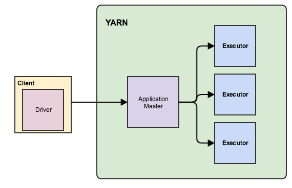
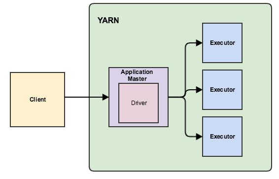
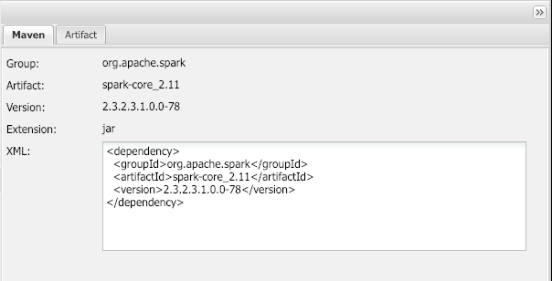

# Spark Workshop - Introduction to Spark

This is an introductory workshop designed for those starting to use spark. We will focus in spark using yarn as cluster manager and review the different deployment modes, configuration and creation of spark applications. 

## Agenda

* Lab 1: Introduction to Spark
* Lab 2: Deployment Modes
* Lab 3: Spark Interactive Shell
* Lab 4: Spark API Introduction
* Lab 5: Standalone Spark Applications
* Lab 6: Build Spark from Source

## Prequisites

1. Install HDP 3, 3 node cluster including the following additional components: 
   1. Spark Client across all nodes. Spark History Server and Spark Thrift Server must be installed on **node3**
   2. Hive
   3. Kafka
   4. Ranger
2. Kerberos needs to be enabled in the cluster
3. You need to install IntelliJ in your machine. You can download IntelliJ _Community Edition_ for Mac [here](https://www.jetbrains.com/idea/download/#section=mac)
4. Hive Interactive needs to be correctly configured as indicated [here](https://docs.hortonworks.com/HDPDocuments/HDP3/HDP-3.0.1/performance-tuning/content/hive_setting_up_llap.html)
5. Make sure all the above is running fine before starting the workshop to avoid delays and other issues

## Lab 1: Introduction to Spark

Spark installation is usually done on edge nodes from where you submit the spark applications. And also in master nodes where spark services like Spark History Server or Spark Thrift Server will run. 

**Step 1:** Review the spark installation components from command line. SSH to **node3** and run the following commands:

```bash
# list the installed spark packages
   rpm -qa | grep spark
# list files installed as part of the package spark
   rpm --verify -v `rpm -qa | grep spark | tail -n1` | more
# checkpoint: you should have a better idea of what exactly is installed and where at this point 

# list files in configuration directory
   ls -l /etc/spark2/conf/
# show content of spark-defaults.conf
   cat /etc/spark2/conf/spark-defaults.conf
# checkpoint: the above listed configuration properties are global settings

# list the spark client binaries
   ls -l /usr/hdp/current/spark2-client/bin/
   
# checkpoint: above list will show spark-submit, spark-shell, pyspark and other important spark client binaries used to run spark applications
```

**Step 2:** Run Spark example applications:

1. Locate SparkPi source code and take a look

```bash
# list the installed spark examples
   ls -l /usr/hdp/current/spark2-client/examples/src/main/scala/org/apache/spark/examples
   cat /usr/hdp/current/spark2-client/examples/src/main/scala/org/apache/spark/examples/SparkPi.scala
   
# checkpoint: identified where source code for scala spark examples is located
```

2. Locate the already _packaged_ examples jar and use it to run SparkPi

```bash
# list the packaged spark examples jar
ls -l /usr/hdp/current/spark2-client/examples/jars/spark-examples*.jar
   
/usr/hdp/current/spark2-client/bin/spark-submit --master yarn --class org.apache.spark.examples.SparkPi /usr/hdp/current/spark2-client/examples/jars/spark-examples*.jar

# checkpoint: You should see similar output as part of stdout of spark-submit spark client:

# Pi is roughly 3.1470757353786767

# Common Issues:
# Run kint before running above command
# User needs to have a valid hdfs home directory

# At this point you have successfully run your first spark application. Congrats!
```

3. Run the example _org.apache.spark.examples.LocalPi_

   1. Review the stdout and compare to the stdout of _org.apache.spark.examples.SparkPi_
   2. What is the difference between _LocalPi_ and _SparkPi_? Hint: Look at source code and try to understand what is different between them.

4. As part of the stdout of the spark-submit command you should see the following important information

```bash
   INFO SparkContext: Running Spark version 2.3.2.3.1.0.0-78
   
   INFO SparkUI: Bound SparkUI to 0.0.0.0, and started at http://c44-node4.squadron-labs.com:4040

   INFO Client: Verifying our application has not requested more than the maximum memory capability of the cluster (15360 MB per container)
   
   INFO Client: Will allocate AM container, with 896 MB memory including 384 MB overhead

   INFO Client: Application report for application_1548101397260_0005 (state: ACCEPTED)

   INFO Client: Application report for application_1548101397260_0005 (state: RUNNING)

   tracking URL: http://c44-node2.squadron-labs.com:8088/proxy/application_1548101397260_0005/
```

The above **INFO** shows:

* Spark version 
* SparkUI port
* Maximum memory per yarn container
* Details how much memory is allocated for the AM
* Reports the application # and status as application is submitted to yarn
* Informs the tracking URL for the application # 

5. Run the example _org.apache.spark.examples.HdfsTest_
   1. Does this example requires any arguments to be passed?
   2. Try to understand what the _HdfsTest_ example is doing
   3. Open the tracking URL displayed in the stdout
   4. Navigate across all the tabs and take note of what information is displayed

6. Look and take note at the rest of examples available. 

## Lab 2: Deployment Modes

Client and Cluster are the two available deployment modes. Typically, **--deploy-mode client** is used by spark-shell and other interactive shells. While **--deploy-mode cluster** is recommended to be used by spark-submit. 

In spark 1.x you can specify both at the same time by using the short form **--master yarn-client** and **--master yarn-cluster**. On spark 2.x this short form has been deprecated and the following warning is displayed if short form is used:

```bash
**Warning**: Master yarn-xxxxx is deprecated since 2.0. Please use master "yarn" with specified deploy mode instead.
```

   #### Client Mode



   **Notes:**

   - Is the default mode if not otherwise specified

   - On yarn-client mode the driver runs on the spark client.

   - Application Master is used only to allocate resources on the yarn cluster. 

   - Executors run on the containers allocated by AM. 

   - If client process is stopped then the spark application is also stopped. 

     

   #### Cluster Mode



**Notes:**

* Needs to be specified as part of the command line arguments
* On yarn-cluster mode the driver runs on the Application Master. 
* The executors run on the containers allocated by AM. 
* Once application has been submitted even if client process is stopped application will continue running on yarn cluster.

### Finding the log files 

Usually you will fetch the logs by running:
```bash
yarn logs -applicationId <application-id>
```

**Note**: While running on yarn it’s necessary to **enable log aggregation**. 

* yarn.log-aggregation-enable=true

* yarn.nodemanager.log-aggregation.roll-monitoring-interval-seconds=3600


No matter the deployment mode **always** get:

* spark client output (consider asking to add -v or --verbose )

* yarn application logs
```bash
$ yarn logs -applicationId <application-id>
```
### Running examples in cluster mode

**Step 1:** Running Spark application in cluster mode

Run the SparkPi, adding the **--deployment-mode cluster** to the spark-submit command

1. Is the _# Pi is roughly 3.1470757353786767_ part of the spark-submit stdout? Why?
2. Find the location where the _# Pi is roughly 3.1470757353786767_ is printed out.
3. Find the stdout of the driver. Where is it printed out? How did you find it?

**Step 2:** Re run the SparkPi in **client** mode and take note of the difference. Collect and review the logs. 

## Lab 3: Spark Interactive Shell

Spark comes with few interactive shell aka REPL for testing and learning spark api. REPL stands for Read-Eval-Print-Loop.

Interactive shells **only** support deployment mode **client**. Spark come with the following interactive shells:

* spark-shell: supports scala language
* pyspark: supports python language
* spark-sql: supports spark SQL
* sparkR: supports R language

All previous clients can be found under */usr/hdp/current/spark2-client/bin*

When launched any of the spark interpreters will already create the SparkSession object to interact with spark api directly. 

```bash
$ spark-shell --master yarn
Setting default log level to "WARN".
To adjust logging level use sc.setLogLevel(newLevel). For SparkR, use setLogLevel(newLevel).
Spark context Web UI available at http://c44-node4.squadron-labs.com:4040
Spark context available as 'sc' (master = yarn, app id = application_1548101397260_0007).
Spark session available as 'spark'.
Welcome to
      ____              __
     / __/__  ___ _____/ /__
    _\ \/ _ \/ _ `/ __/  '_/
   /___/ .__/\_,_/_/ /_/\_\   version 2.3.2.3.1.0.0-78
      /_/

Using Scala version 2.11.8 (Java HotSpot(TM) 64-Bit Server VM, Java 1.8.0_112)
Type in expressions to have them evaluated.
Type :help for more information.

scala> sc.version
res0: String = 2.3.2.3.1.0.0-78

scala> spark.version
res1: String = 2.3.2.3.1.0.0-78

scala> spark
res2: org.apache.spark.sql.SparkSession = org.apache.spark.sql.SparkSession@20f99c18
```
Logs for the interactive shell are splitted in two:

* Driver output is printed on the same client stdout
* AM and Executors output is printed to the yarn container logs

##### Step 1: Testing the spark-shell / Run the SparkPi code in spark-shell interactive

1. Open spark-shell --master yarn
2. Copy and paste the following code and check the output:
```scala
import scala.math.random
val slices = 2
val n = math.min(100000L * slices, Int.MaxValue).toInt // avoid overflow
val count = spark.sparkContext.parallelize(1 until n, slices).map { i =>
    val x = random * 2 - 1
    val y = random * 2 - 1
    if (x*x + y*y <= 1) 1 else 0
}.reduce(_ + _)
println(s"Pi is roughly ${4.0 * count / (n - 1)}")
```
##### Step 2: Testing pyspark / Run the pi.py code in pyspark interactive

1. Open pyspark --master yarn
2. Copy and paste the folloiwng python code and check the output:

```python
from __future__ import print_function
import sys
from random import random
from operator import add

partitions = 2
n = 100000 * partitions
def f(_):
    x = random() * 2 - 1
    y = random() * 2 - 1
    return 1 if x ** 2 + y ** 2 <= 1 else 0

count = spark.sparkContext.parallelize(range(1, n + 1), partitions).map(f).reduce(add)
print("Pi is roughly %f" % (4.0 * count / n))
```
##### Step 3: Run wordcount using spark-shell

1. Using spark-shell write a word count application that reads a hdfs file and print the counts for each word to the stdout. Hint: Look into the examples and re-use the code from there.

## Lab 4: Spark API Introduction

We will give a brief introduction to the Dataset API

#### Dataframe and Dataset
DataFrame and Dataset API **enclose meta information about the structure of the data**. Spark leverages this information to optimize the execution. Both DF and DS benefit from the Catalyst Optimizer. Conceptually, consider **DataFrame** as an alias for a collection of generic objects **Dataset[Row]**, where a Row is a generic untyped JVM object

A Dataset is a strongly typed collection of domain-specific objects that can be transformed in parallel using functional or relational operations. **Each Dataset also has an untyped view called a DataFrame, which is a Dataset of Row.** 

#### RDD

This was the original/initial available API that is still used mostly when handling unformatted data. Resilient distributed dataset API is a **programmatic** API. Spark has a lazy execution model. Transformations are not executed as long as no action is called upon the RDD. Once an action is performed the RDD is compiled into a DAG of RDDs. For each shuffle dependency you have a stage and each stage consist on number of tasks. 

##### Praparing to use Movielens dataset


```bash
wget http://files.grouplens.org/datasets/movielens/ml-20m.zip -O /tmp/movielens.zip 

cd /tmp/ && unzip movielens.zip -d movielens 

hdfs dfs -mkdir ml 
hdfs dfs -mkdir ml/movies 
hdfs dfs -put movielens/ml-20m/movies.csv ml/movies/ 
hdfs dfs -mkdir ml/ratings
hdfs dfs -put movielens/ml-20m/ratings.csv ml/ratings/
```

##### Dataset Example

Using spark-shell --master yarn:

```scala
scala> val movies = spark.read.format("csv").option("header", "true").load("ml/movies") 

scala> case class Movie(movieId:String, title:String, genres:String) 

scala> val movies = spark.read.format("csv").option("header", "true").load("ml/movies").as[Movie] 

scala> movies.show(10)
+-------+--------------------+--------------------+
|movieId|               title|              genres|
+-------+--------------------+--------------------+
|      1|    Toy Story (1995)|Adventure|Animati...|
|      2|      Jumanji (1995)|Adventure|Childre...|
|      3|Grumpier Old Men ...|      Comedy|Romance|
|      4|Waiting to Exhale...|Comedy|Drama|Romance|
|      5|Father of the Bri...|              Comedy|
|      6|         Heat (1995)|Action|Crime|Thri...|
|      7|      Sabrina (1995)|      Comedy|Romance|
|      8| Tom and Huck (1995)|  Adventure|Children|
|      9| Sudden Death (1995)|              Action|
|     10|    GoldenEye (1995)|Action|Adventure|...|
+-------+--------------------+--------------------+
only showing top 10 rows

scala> movies.printSchema
root
 |-- movieId: string (nullable = true)
 |-- title: string (nullable = true)
 |-- genres: string (nullable = true)
```

##### Dataframe Example

Using spark-shell --master yarn:

```scala
scala> val movies = spark.read.format("csv").option("header", "true").load("ml/movies") 
scala> movies.show(10)
+-------+--------------------+--------------------+
|movieId|               title|              genres|
+-------+--------------------+--------------------+
|      1|    Toy Story (1995)|Adventure|Animati...|
|      2|      Jumanji (1995)|Adventure|Childre...|
|      3|Grumpier Old Men ...|      Comedy|Romance|
|      4|Waiting to Exhale...|Comedy|Drama|Romance|
|      5|Father of the Bri...|              Comedy|
|      6|         Heat (1995)|Action|Crime|Thri...|
|      7|      Sabrina (1995)|      Comedy|Romance|
|      8| Tom and Huck (1995)|  Adventure|Children|
|      9| Sudden Death (1995)|              Action|
|     10|    GoldenEye (1995)|Action|Adventure|...|
+-------+--------------------+--------------------+
only showing top 10 rows

scala> movies.printSchema
root
 |-- movieId: string (nullable = true)
 |-- title: string (nullable = true)
 |-- genres: string (nullable = true)
```

#### Learning the Dataset API [here](**API:** <https://spark.apache.org/docs/latest/api/scala/index.html#org.apache.spark.sql.Dataset>):

Using spark-shell --master yarn

##### Step 1: Actions

1. Try the different alternatives of show function.

2. What action is used to count the number of rows? 

3. Enumerate 3 functions that could be used to return the first row?

4. Execute the folloiwng code and find out where the rows are printed out:
```scala
   scala> movies.foreach(r => println(r))
```
5. Execute the following code and describe what is the difference between toLocalIterator and collect
```scala
   scala> val moviesIter =  movies.toLocalIterator()

   scala> while(moviesIter.hasNext) println(moviesIter.next());
```
##### Step 2: Dataset functions

1. Run **movies.explain**() and movies.explain(true) - Notice the difference between both
2. Run movies.filter("movieId==8").explain(true) - Take note of the differneces compared to the above movies.expalin(trie)
3. You can also get access to all RDD api methods from the Dataset API. Lets take a look:
```scala
scala> movies.rdd.getNumPartitions
res21: Int = 1

scala> movies.rdd.
!=             coalesce              dependencies   foreachPartition        intersection             min                  reduce             takeAsync         unpersist

##             collect               distinct       foreachPartitionAsync   isCheckpointed           name                 repartition        takeOrdered       wait
+              collectAsync          ensuring       formatted               isEmpty                  ne                   sample             takeSample        zip
  ++             compute               eq             getCheckpointFile       isInstanceOf             notify               saveAsObjectFile   toDebugString     zipPartitions
  ->             context               equals         getClass                iterator                 notifyAll            saveAsTextFile     toJavaRDD         zipWithIndex
  ==             count                 filter         getNumPartitions        keyBy                    partitioner          setName            toLocalIterator   zipWithUniqueId
  aggregate      countApprox           first          getStorageLevel         localCheckpoint          partitions           sortBy             toString          →
  asInstanceOf   countApproxDistinct   flatMap        glom                    map                      persist              sparkContext       top
  cache          countAsync            fold           groupBy                 mapPartitions            pipe                 subtract           treeAggregate
  cartesian      countByValue          foreach        hashCode                mapPartitionsWithIndex   preferredLocations   synchronized       treeReduce
  checkpoint     countByValueApprox    foreachAsync   id                      max                      randomSplit          take               union

scala> val movies4p = movies.repartition(4)
movies4p: org.apache.spark.sql.Dataset[org.apache.spark.sql.Row] = [movieId: string, title: string ... 1 more field]

scala> movies4p.rdd.getNumPartitions
res22: Int = 4
```

4. Explore other Dataset and RDD functions

##### Step 3: Transformations

Using spark-shell --master yarn and the movielens dataset perform perform the following operations:

1. Try running coalesce and repartition. Read te difference between both in the Dataset api documentation.
2. Filter and count Action movies
3. Order by title descending and show the last 10 rows

##### Step 4: Advanced transformations

1. Join the movies with the ratings and find the top 10 best rated movies
2. Save the top 10 best movies to hdfs as csv file
3. Get the count of movies per genre. Hint: consider using **flatMap**
4. Save the count of movies per genre to hdfs as orc table

## Lab 5: Standalone Spark Applications

You will learn how to create a spark application using IntelliJ. We will review the depenencies and repositories needed to build, package and deploy your application jar successfullly.

### Scala Spark Applicaitons

##### Step 1: Create IntelliJ project

1. Steps on how to setup Spark Scala project usin IntelliJ are available [here](https://www.youtube.com/watch?v=xmIInUUDZSA) - Please make sure you watch the video

   1. Create a Maven project using JntelliJ

   2. Reaname src/main/java to src/main/scala

   3. Rename test/java to test/java

   4. Replace the pom.xml file in your project with the following content:

   ```xml
   <?xml version="1.0" encoding="UTF-8"?>
   <project xmlns="http://maven.apache.org/POM/4.0.0"
            xmlns:xsi="http://www.w3.org/2001/XMLSchema-instance"
            xsi:schemaLocation="http://maven.apache.org/POM/4.0.0 http://maven.apache.org/xsd/maven-4.0.0.xsd">
       <modelVersion>4.0.0</modelVersion>
   
       <groupId>spark-workshop</groupId>
       <artifactId>spark-hello-world</artifactId>
       <version>1.0</version>
   
       <properties>
           <maven.compiler.source>1.8</maven.compiler.source>
           <maven.compiler.target>1.8</maven.compiler.target>
           <scala.version>2.11.6</scala.version>        
           <encoding>UTF-8</encoding>
       </properties>
   
       <dependencies>
           <dependency>
               <groupId>org.scala-lang</groupId>
               <artifactId>scala-library</artifactId>
               <version>${scala.version}</version>
               <scope>compile</scope>
           </dependency>
           
       </dependencies>
       <build>
           <sourceDirectory>src/main/scala</sourceDirectory>
           <plugins>
               <plugin>
                   <groupId>org.scala-tools</groupId>
                   <artifactId>maven-scala-plugin</artifactId>
                   <executions>
                       <execution>
                           <goals>
                               <goal>compile</goal>
                               <goal>testCompile</goal>
                           </goals>
                       </execution>
                   </executions>
                   <configuration>
                       <scalaVersion>${scala.version}</scalaVersion>
                   </configuration>
               </plugin>
               <plugin>
                   <groupId>org.apache.maven.plugins</groupId>
                   <artifactId>maven-compiler-plugin</artifactId>
                   <version>3.5.1</version>
                   <configuration>
                       <source>1.8</source>
                       <target>1.8</target>
                   </configuration>
               </plugin>
           </plugins>
       </build>
   </project>
   ```
   5. Build using _mvn clean && man package_

##### Step 2: Find the spark dependencies

1. Open http://repo.hortonworks.com in your browser and search for correct pom dependencies for artifactId

   * **spark-sql**

   Locate the correct artifact for version **2.3.2.3.1.0.0-78**

   

2. Copy the dependecies on the above pom.xml and build using _mvn clean && mvn package_

3. Add the missing repositories to your pom.xml - Hint: you can place it between properties and dependencies section

   ```xml
   <repositories>
       <repository>
           <id>hortonworks repo</id>
           <name>hortonworks repo</name>
           <url>http://repo.hortonworks.com/content/repositories/releases/</url>
       </repository>
       <repository>
           <id>hortonworks jetty</id>
           <name>hortonworks jetty repo</name>
           <url>http://repo.hortonworks.com/content/repositories/jetty-hadoop/</url>
       </repository>
   </repositories>
   ```

4. Try to build your application again - This time it should build successfully

##### Step 3: Create Hello object, package and run it!

1. Create a new Scala object named Hello and place the folloiwng content

```scala
import org.apache.spark.sql.SparkSession

object Hello extends Greeting with App {
  val spark = SparkSession.builder.appName(appName).getOrCreate()

  println(greeting)
  println(spark.version)
}
trait Greeting {
  lazy val appName = "Hello World Spark App"
  lazy val greeting: String = "hello"
}
```

6. Build the application again, deploy jar to cluster **node3** and run using spark-sumbmit command in client and cluster mode. _Hint:_ read about --class argument
7. Congratulatios! At this point you have built a spark sacala standalone application and succesfully deployed it and run it in your cluster.

### Pyspark Applications

Pyspark applications are easier to create and deploy since there is minumum project structure and spark dependencies are automatically managed.

##### Step 1: Create a simple pyspark application 

1. You can se vi or your favorite text editor. Or more advance IDE like pyCharm is also a good alternative

2. Create a file called helloworld.py and open it on your editor

3. Add the folloiwng code:

   ```python
   """helloworld.py"""
   from pyspark.sql import SparkSession
   
   spark = SparkSession.builder.appName("Hello World Spark App").getOrCreate()
   print("Hello World!")
   print(spark.version)
   spark.stop()
   ```

4. Copy and place the file in node3. Run the python using spark-submit command.
##### Step 2: Deploy using spark-submit

```bash
spark-submit --master yarn helloworld.py
```

1. By running the above command you will have succcefully run your pyspark application!


## Lab 6: Build Spark from Source

Try the following steps and build the spark from source picking the hdp version you like to build. Spark documentation on building from source can be found [here](http://spark.apache.org/docs/latest/building-spark.html)

##### Step 1: Clone and checkout the tag you like to build
```bash
mkdir spark2 && cd spark2

git clone https://gerrit.eng.hortonworks.com/r/spark2
```
##### Step 2: Build

As part of the build we need to specify the versions for each of the components here is an example:

```bash
build/mvn -Dhadoop.version=2.7.3.2.6.3.0-235 -Dzookeeper.version=3.4.6.2.6.3.0-235 -Dhive.version=1.21.1.2.6.3.0-235 -Dhbase.version=1.1.2.2.6.3.0-235 -Dflume.version=1.5.2.2.6.3.0-235 -Dkafka.version=0.10.1.2.6.3.0-235 -DskipTests clean package 
... thousand of lines ....
[INFO] ------------------------------------------------------------------------
[INFO] BUILD SUCCESS
[INFO] ------------------------------------------------------------------------
[INFO] Total time: 14:54 min
[INFO] Finished at: 2018-01-31T17:33:01-05:00
[INFO] Final Memory: 86M/946M
[INFO] ------------------------------------------------------------------------
```

For simplicity we are skiping the test cases. 

##### Step 3: Building a Runnable Distribution

To create a Spark distribution like those distributed by the Spark Downloads page, and that is laid out so as to be runnable, use _./dev/make-distribution.sh_ in the project root directory. It can be configured with Maven profile settings and so on like the direct Maven build. Example: 

```bash
./make-distribution.sh -Dhadoop.version=2.7.3.2.6.3.0-235 -Dzookeeper.version=3.4.6.2.6.3.0-235 -Dhive.version=1.21.1.2.6.3.0-235 -Dhbase.version=1.1.2.2.6.3.0-235 -Dflume.version=1.5.2.2.6.3.0-235 -Dkafka.version=0.10.1.2.6.3.0-235  
```

This will build Spark distribution along with Python pip and R packages. For more information on usage, run _./make-distribution.sh --help_

Output of the make-distribution command is a **dist** directory with the binaries.


